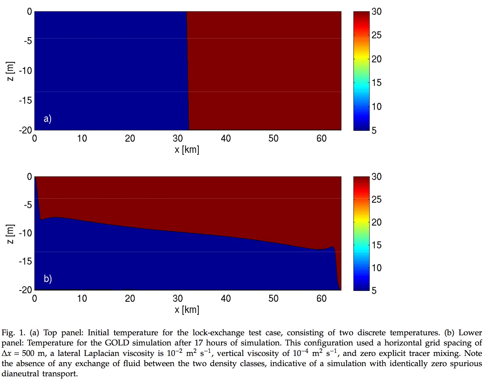

# Lock Exchange demonstration case

Here a description of the test case + link toward the src and notebooks. 

## Objectives

The lock exchange experiment can be use to see the impact of different tracer advection schemes into spurious mixing. 

## Physical description

For the lock exchange test case, a closed two-dimensional vertical domain with a constant depth of H = 20 m and a length of L = 64 km is considered. Initially, the left half of the domain (x < 32 km) has a density of σt = 5 kg m−3 and the right half of the domain (x ⩾ 32 km) has a density of σt = 0 kg m−3, separated by a vertical line.
Initial surface elevation and velocity are zero.
At t = 0, the separation is removed such that the dense water is forced under the fresh water.
Earth rotation, bed friction and mixing are neglected, such that the effective density mixing is only due to advection of density.
This scenario been suggested by Haidvogel and Beckmann (1999) as a test case for advection schemes in ocean models, and has been intensively used by Burchard and Bolding (2002) for testing the advection schemes in GETM.
Here, the numerical mixing of the first-order upstream (UBS) and the FCT2 and FCT4 schemes will be assessed for five different resolutions: (peut être?)

